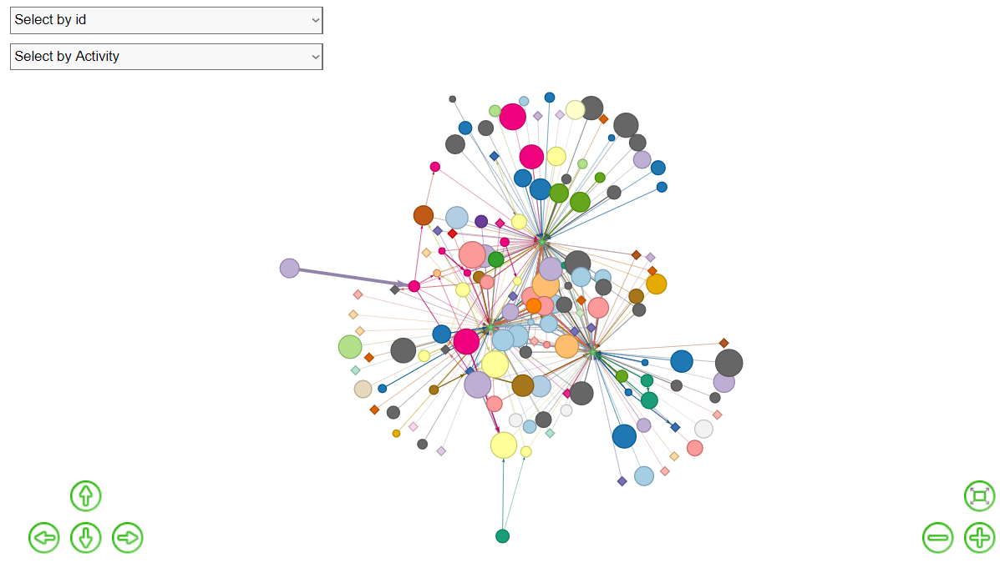
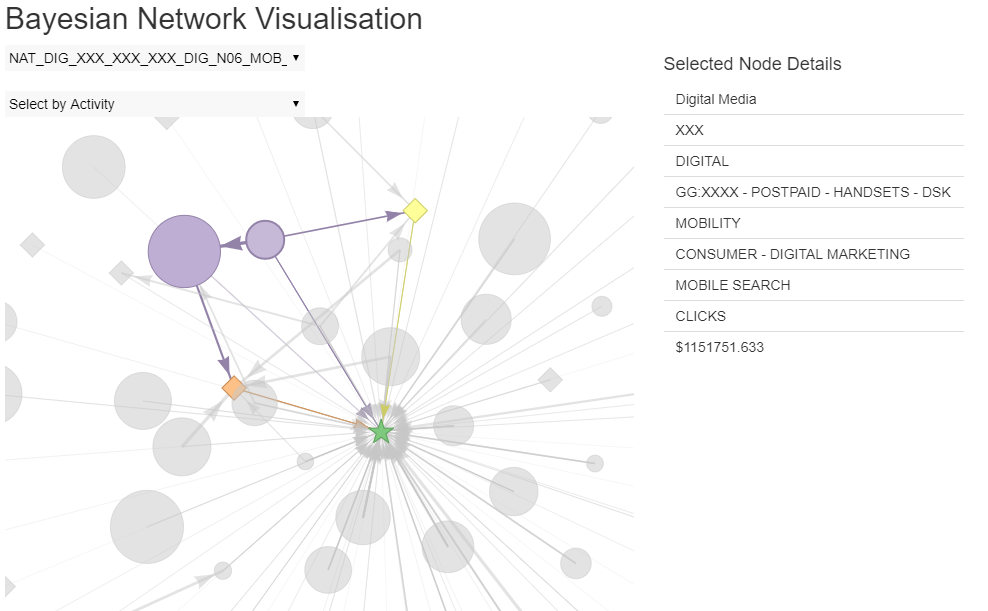

# Bayesian Network Visualisation

In 2016, I worked on a Marketing Mix Modelling project with a large Australian Telco company where my team revamped the way the company does Marketing Analytics. Due to confidentiality, I will not explain in detail, but in a nutshell, we built a model based on Bayesian Networks to quantify the effects and ROI of various marketing activities on a number of performance variables (product activations, deactivations etc.). I built a visualisation using RShiny to present the results of the model to non-technical stakeholders. This is one of the preliminary versions of the network visualisation, which we later embedded into a cloud-hosted web application that was ultimately delivered as part of the project.

Note: Due to data confidentiality reasons, the data used here has been scrubbed of any mention of the client name and all marketing spends have been imputed with random values.

The size of the nodes represent the total spend of the marketing activity, the thickness of the connections represent the strength of the relationship (in other words, the ROI for that activity) and the direction of the arrows represents the direction of the impact. Below are some screenshots of the visualisation. The RShiny app is hosted on [here](https://martycheung.shinyapps.io/bayesian-network-visualisation/).

